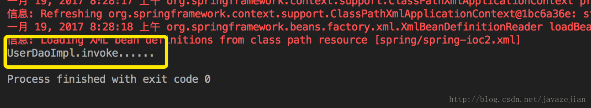
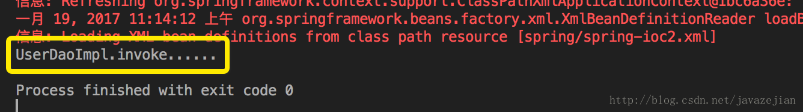
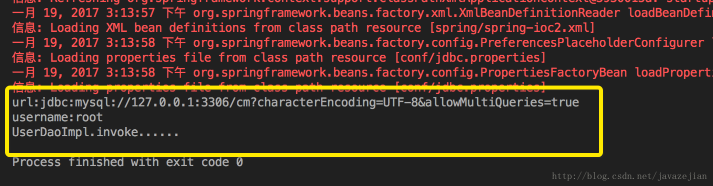
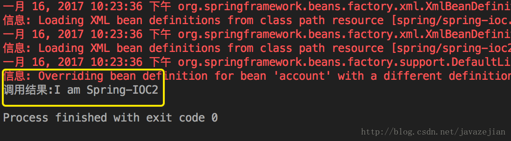
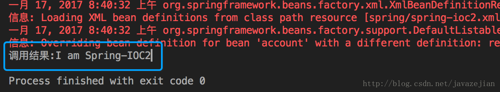
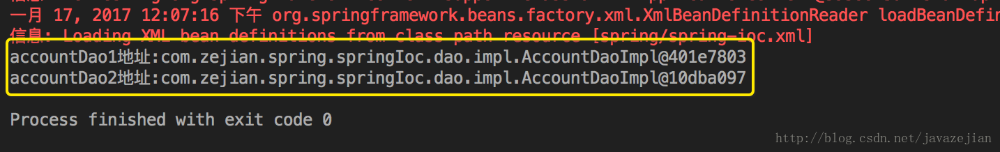
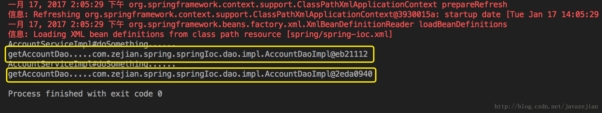

**source: [关于Spring IOC (DI-依赖注入)你需要知道的一切](http://blog.csdn.net/javazejian/article/details/54561302)**

《spring入门经典》这本书无论对于初学者或者有经验的工程师还是很值一看的，最近花了点时间回顾了Spring的内容，在此顺带记录一下，本篇主要与spring IOC相关 ，这篇博文适合初学者也适合spring有过开发经验的工程师，前者可用于全面了解Spring IOC的知识点，后者且过目进而查漏补缺，ok~，以下是主要内容：

* Spring IOC 的原理概述
* 快速入门案例
* Spring 容器装配BeanXML配置方式和注解配置方式
* Spring 依赖注入
    * Setter注入
    * 构造函数注入
    * 循环依赖
    * 自动装配与注解注入
        * 基于xml的自动装配
        * 基于注解的自动装配AutowiredResourceValue
            * 基于Autowired注解的自动装配
            * 基于Resource注解的自动装配
            * 基于Value注解的自动装配以及properties文件读取
* IOC容器管理 bean
    * Bean的命名以及实例化方法
        * Bean的命名
        * Bean实例化方法
    * Bean的重写机制
    * Bean的作用域
        * Singleton作用域
        * prototype作用域
        * request与session作用域
        * globalSession作用域
    * Bean的延长加载
* contextcomponent-scan与contextannotation-config
* IOC 与依赖注入的区别

#Spring IOC 的原理概述

在我们的日常开发中，创建对象的操作随处可见以至于对其十分熟悉的同时又感觉十分繁琐，每次需要对象都需要亲手将其new出来，甚至某些情况下由于坏编程习惯还会造成对象无法被回收，这是相当糟糕。但更为严重的是，我们一直倡导的是松耦合，少入侵原则，这种情况下变得一无是处。于是前辈们开始谋求改变这种编程陋习，考虑如何使用编码更加耦合，由此而来的解决方案是面向接口的编程，于是便有了如下写法：

    /**
     * Created by zejian on 2017/1/15.
     * Blog: http://blog.csdn.net/javazejian [原文地址，请尊重原创]
     */
    public class BookServiceImpl {
        //class
        private BookDaoImpl bookDaoImpl;
        public void oldCode()｛
            //原来的做法
            bookDaoImpl = new BookDaoImpl();
            bookDaoImpl.getAllCategories();
        }
    }
    //==============new===============
    public class BookServiceImpl {
        //interface
        private BookDao bookDao;
        public void newCode() {
            //变为面向接口编程
            bookDao = new BookDaoImpl();
            bookDao.getAllCategories();
        }
    }

BookServiceImpl类中由原来直接与BookDaoImpl打交道变换为与BookDao打交道，即使BookDao最终实现依然是BookDaoImpl，这样做的好处是显而易见的，所有调用都通过接口BookDao来完成，而接口的真正的实现者和最终的执行都是BookDaoImpl，当修改BookDaoImpl时，触及的代码就非常少了，即使替换BookDaoImpl类，也只需要修改BookDao指向新的实现类。

虽然上述的代码在很大程度上降低了代码的耦合度，但是代码依旧存在入侵性和一定程度的耦合性，比如在修改BookDao的实现类时，仍然需要修改BookServiceImpl的内部代码，当依赖的类多起来时，查找和修改的过程会显得相当糟糕，因此我们仍需要寻找一种方式，它可以令开发者无需触及BookServiceImpl内部代码的情况下实现修改BookDao的实现类，以便达到最低耦合度和最少入侵的目的。实际上存在一种称为反射的编程技术可以协助解决上述问题，反射是一种根据给出的完整类名（字符串方式）来动态地生成对象的技术，这种编程方式这种编程方式可以对象在生成时才决定到底是哪一种对象，因此可以这样假设，在某个配置文件，该文件已写好BookDaoImpl类的完全限定名称，通过读取该文件而获取BookDao的真正实现类的完全限定名称，然后通过反射技术在运行时动态生成该类，最终赋值给BookDao接口，也就解决了刚才存在的问题，这里为简单演示，使用properties文件作为配置文件，className.properties如下：

    bookDao.name = com.zejian.spring.dao.BookDaoImpl

获取该配置文件作息动态为BookDao生成实现类：

    public class BookServiceImpl implements BookService {
        //读取配置文件的工具类
        PropertiesUtil propertiesUtil = new PropertiesUtil("conf/className.properties");
        private BookDao bookDao;
        public void DaymicObject() throws ClassNotFoundException, IllegalAccessException, InstantiationException {
            //获取完全限定名称
            String className = propertiesUtil.get("bookDao.name");
            //通过反射
            Class c = Class.forName(className);
            //动态生成实例对象
            bookDao = (BookDao) c.newInstance();
        }
    }

的确如我们所愿生成了BookDao的实例，这样做的好处是在替换BookDao的实现类的情况下只需要修改配置文件而无需触及BookServceImpl的内部代码，从而把代码修改的过程转到配置文件中，相当于BookDaoImpl及内部的BookDao通过配置文件与BookDao的实现类进行关联，BookServiceImpl与BookDao的实现类间也就实现了解耦合，当然BookServiceImpl类中存在着的BookDao对象是无法避免的，毕竟这是协同工作的基础，我们只能最大程度去解耦合。

了解了上述的问题再来理解IOC就显得简单多了。Spring IOC也是一个Java对象，在某些特定的时间被创建后，可以进行对其它对象的控制，包括初始化、创建、销毁等。简单地理解，在上述过程中，我们通过配置文件配置了BookDaoImpl实现类的完全限定名称，然后利用反射在运行时为BookDao创建实际实现类，包括BookServiceImpl的创建，Spring IOC容器都会帮我们完成，而我们唯一需要做的就是把需要创建的类和其他依赖的类以配置文件的方式告诉IOC容器需要创建哪些类和注入哪些类即可。Spring通过这种控制反转（IoC）的设计模式促进了松耦合，这种方式使一个对象依赖其它对象时会通过被动的方式传送过来（如BookServiceImpl被创建时，其依赖的BookDao的实现类也会同时被注入BookServiceImpl中），而不是通过手动创建这些类。我们可以把IoC模式看做是工厂模式的升华，可以把IoC看作是一个大工厂，只不过这个大工厂需要生成的对象都是在配置文件（XML）中给出定义的，然后利用Java的反射技术，根据XML中给出的类名生成相应的对象。从某种程度上来说，IoC相当于把在工厂方法里通过硬编码创建对象的代码，改变由XML文件来定义，也就是把工厂和对象生成这两者独立分隔开来，目的就是提高灵活性和可维护性，更是达到最低的耦合度，因此我们要明白所谓的IOC就是将对象的创建权交由Spring完成，从此解放手动创建对象的过程，同时让类与类间的关系达到最低耦合度。

#快速入门案例

理解了Spring IOC模式（容器）后，我们来看一个简单入门实例。使用Spring的IOC功能，必须先引入Spring的核心依赖包（使用Maven作为构建工具）：

    <dependency>
        <groupId>org.springframewok</groupId>
        <artifactId>spring-core</artifactId>
        <version>${spring.version}</version>
    </dependency>

    <dependency>
        <groupId>org.springframework</groupId>
        <artifactId>spring-beans</artifactId>
        <version>${spring.version}</version>
    </dependency>

    <dependency>
        <groupId>org.springframework</groupId>
        <artifactId>spring-context</artifactId>
        <version>${spring.version}</version>
    </dependency>

然后创建Dao层（AccountDao）：

    public interface AccountDao {
        void addAccount();
    }

实现类（AccountDaoImpl）：

    public class AccountDaoImpl implements AccountDao {
        @Override
        public void addAccounＴ() {
            System.out.println("addAccount...");
        }
    }

再创建Service，AccountService

    /**
     * Created by zejian 2017/1/15.
     * Blog: http://blog.csdn.net/javazejian [原文地址，请尊重原创]
     */
    public interface AccountService {
        void doSomething();
    }

实现类：

    /**
     * Created by zejian on 2017/1/15.
     * Blog: http://blog.csdn.net/javazejian [原文地址，请尊重原创]
     */
    public class AccountServiceImpl implements AccountService {
        /**
         * 需要注入的对象
         */
        private AccountDao accountDao;
        public void setAccountDao(AccountDao accountDao) {
            this.accountDao = accountDao;
        }
        @Override
        public void doSomething() {
            System.out.println("AccountServiceImpl#doSomething...");
            accountDao.addAccount();
        }
    }

上面我们创建了Dao层和Service层的接口类及其实现类，其中Service层的操作依赖于Dao层，下面通过Spring的IOC容器帮助我们创建并注入这些类。IOC使用的是XML配置文件，代码如下：

    <beans xmlns="http://www.springframework.org/schema/beans"
           xmlns:xsi="http://www.w3.org/2001/XMLSchema-instance"
           xsi:schemaLocation="http://www.springframework.org/schema/beans http://www.springframework.org/schema/beans/spring-beans.xsd">
        <!-- 声明accountDao对象，交给Spring创建 -->
        <bean name="accountDao" class="com.zejian.spring.springIoc.dao.impl.AccountDaoImpl"/>
        <!-- 声明accountService对象，交给Spring创建 -->
        <bean name="accountService" class="com.zejian.spring.springIoc.service.impl.AccountServiceImpl">
            <!-- 注入accountDao对象，需要set方法 -->
            <property name="accountDao" ref="accountDao"/>
        </bean>
    </beans>

从XML文件中，我们需要声明一个beans的顶级标签，同时需要引入核心命名空间，Spring的功能在使用时都需要声明相对应的命名空间，上述的命名空间是最基本的。然后通过bean子标签声明那些需要IOC容器帮助我们创建的类，其中name是指名IOC创建后该对象的名称（当然也可以使用id替换name，这个后面会讲到），class则是告诉IOC这个类的完全限定名称，IOC就会通过这组信息利用反射技术帮助我们创建对应的类对象，如下：

    <!-- 声明accountDao对象，交给Spring创建 -->
    <bean name="accountDao" class="com.zejian.spring.springIoc.dao.impl.AccountDaoImpl"/>

接着我们还看到如下声明，accountService声明中多出了一个property标签，这个标签指向了我们刚才创建的accountDao对象，它的作用是把accountDao对象传递给accountService实现类中的accountDao属性，该属性必须拥有set方法才能注入成功，我们把这种往accountDao对象中注入其他对象（accountDao）的操作称为依赖注入，这个后面会分析到，其中的name必须与AccountService实现类中的变量名称相同，到此我们就完成对需要创建的对象的声明。接着看看如何使用它们。

    <!-- 声明accountService对象，交给Spring创建 -->
    <bean name="accountService" class="com.zejian.spring.springIoc.service.impl.AccountSericeImpl">
        <!-- 注入accontDao对象，需要set方法 -->
        <property name="accountDao" ref="accountDao"/>
    </bean>

    public class AccountServiceImpl implements AccountService {
        /**
         * 需要注入的对象
         */
        private AccountDao accountDao;
        public void setAccountDao(AccountDao accountDao) {
            this.accountDao = accountDao;
        }
    }

使用这些需要利用Spring提供的核心类，ApplicationContext，通过该类去加载声明好的配置文件，然后便可以获取到我们需要的类了。

    @Test
    public void testByXml() throws Exception {
        //加载配置文件
        ApplicationContext applicationContext = new ClassPathXmlApplicationContext("spring/spring-ioc.xml");
        //AccountService accountService = applicationContext.getBean("accountService", AccountService.class);
        //多次获取并不会创建多个accountService对象，因为Spring默认创建是单例的作用域
        AccountService accountService = (AccountService) applicationContext.getBean("accountService");
        accountService.doSomething();
    }

能过这个简单的案例相信大家已大概理解了Spring IOC主要是干什么了，接下来就详细分析它，上述的运行结果：

#Spring容器装配Bean（XML配置方式和注解方式）

有了大概了解后，先分析一下前面案例，我们采用XML配置文件的方式对bean进行声明和管理，每一个bean标签都代表着需要被创建的对象并通过property标签可以为该类型注入其他依赖对象（关于依赖后面会分析，这里简单理解为将对象实例传入到某个bean实例即可），通过这种方式Spring容器就可以成功知道我们需要创建哪些bean实例，如下：

    <bean xmlns="http://www.springframework.org/schema/beans"
          xmlns:xsi="http://www.w3.org/2001/XMLSchema-instance"
          xsi:schemaLocation="http://www.springframework.org/schema/beans http://www.springframework.org/schema/beans/spring-beans.xsd">
        <!-- 声明accountDao对象，交给Spring创建 -->
        <bean name="accountDao" class="com.zejian.spring.springIoc.dao.impl.AccountDaoImpl"/>
        <!-- 声明accountService对象，交给Spring创建 -->
        <bean name="accountService" class="com.zejian.spring.springIoc.service.impl.AccountServiceImpl">
            <!-- 注入accountDao对象，需要set方法 -->
            <property name="accountDao" ref="accountDao"/>
        </bean>
    </beans>

然后通过ClassPathXmlApplicationContext去加载Spring配置文件，接着获取想要的实例bean并调用相应方法执行。对于ClassPathXmlApplicationContext默认加载classpath路径下的文件，只需要指明对应文件的classpath路径即可。如果存在多个配置文件，则只需分别传递即可，ClassPathXmlApplicationContext是一个可以接收可变参数的构造函数。实际上ClassPathXmlApplicationContext还有一个孪生兄弟FileSystemXmlApplicationContext，它默认为项目工作路径即项目的根目录，至于使用哪个，博言觉得没有多大的差别。

    //默认查找classpath路径下的文件
    ApplicationContext applicationContext = new ClassPathXmlApplicationContext("spring/spring-ioc.xml");
    //多文件，也可传递数组
    ApplicationContext applicationContext = new ClassPathXmlApplicationContext("spring/spring-ioc.xml", "spring/spring-ioc2.xml", ...);
    //默认为项目工作路径 即项目的根目录
    FileSystemXmlApplicationContext applicationContext = new FileSystemXmlApplicationContext("/src/main/resources/spring/spring-ioc.xml");
    //也可以读取classpath下的文件
    FileSystemApplicationContext applicationContext = new FileSystemXmlApplicationContext("classpath:spring/spring-ioc.xml");
    //使用前缀file表示的是文件的绝对路径
    ApplicationContext applicationContext = new FileSystemXmlApplicationContext("file:D:/app.spring.xml");
    //多文件与ClassPathXmlApplicationContext相同

ok~，了解完如何加载配置文件后，下面将采用注解的方式来达到上述XML的配置效果：

    package com.zejian.spring.springIoc.conf;

    import com.zejian.spring.springIoc.dao.AccountDao;
    import com.zejian.spring.springIoc.dao.impl.AccountDaoImpl;
    import com.zejian.spring.springIoc.service.AccountService;
    import com.zejian.spring.springIoc.service.impl.AccountServiceImpl;
    import org.springframework.context.annotation.Bean;
    import org.springframework.context.annotation.Configuration;

    /**
     * Created by zejian on 2017/1/15.
     * Blog: http://blog.csdn.net/javazejian [原文地址，表尊重原创]
     */
    @Configuration
    public class BeanConfiguration {
        @Bean
        public AccountDao accountDao() {
            return new AccountDaoImpl();
        }
        @Bean
        public AccountService accountService() {
            AccountServiceImpl bean = new AccountServiceImpl();
            //注入dao
            bean.setAccountDao(accountDao());
            return bean;
        }
    }

上述代码中使用了@Configuration注解标明BeanConfiguration类，使得BeanConfiguration类替代了XML文件，也就是说注解@Configuration等价于<beans>标签。在该类中，每个使用注解@Bean的公共方法对应着一个<bean>标签的定义，即@Bean等价于<bean>标签。这种基于Java的注解配置方式是在Spring3.0中引入的，此时使用到注解，因此必须确保spring-context包已引入。

    <dependency>
        <groupId>org.springframework</groupId>
        <artifactId>spring-context</artifactId>
        <version>${spring.version}</version>
    </dependency>

那怎么使用呢？事实上跟XML很相似，不过这是使用到AnnotationConfigApplicationContext来加载Java的配置文件，运行结果跟XML一样。

    @Test
    public void testByConfigurationAnnotation() throws Exception {
        AnnotationConfigApplicationContext config = new AnnotationConfigApplicationContext(BeanConfiguration.class);
        //名称必须和BeanConfiguration中方法名称一致
        AccountService accountService = (AccountService) config.getBean("accountService");
        accountService.doSomething();
    }

这里我们需要明白的是，在大部分情况下更倾向于使用XML来配置Bean的相关信息，这样会更加方便我们对代码进行管理，因此后面的分析都会基于XML的配置，除了前面通过在XML中使用<bean>标签为每个类声明实例外，Spring容器还为我们提供了基于注解的声明方式，这点放在后面分析，接下来看一下Spring提供的依赖注入功能。

#Spring依赖注入

所谓的依赖注入，其实是当一个bean实例引用到了另外一个bean实例时Spring容器帮助我们创建依赖的bean实例并注入（传递）到另一个bean中，如上述案例中的AccountService依赖AccountDao，Spring容器会在创建AccountService的实现类和AccountDao的实现类后，把AccountDao的实现类注入AccountService实例中，下面分别介绍setter注入和构造函数注入。

##Setter注入

Setter注入顾名思义，被注入的属性需要有set方法，Setter注入支持简单类型和引用类型，Setter注入时在bean实例创建完成后执行的。直接观察前面的案例，对象注入使用<property>的ref属性。

    <!-- 声明accountDao对象交给Spring创建 -->
    <bean name="accountDao" class="com.zejian.spring.springIoc.doa.impl.AccountDaoImpl"/>
    <!-- 声明accountService对象，交给Spring创建 -->
    <bean name="accountService" class="com.zejian.spring.springIoc.service.impl.AccountServiceImpl">
        <!-- 通过Setter注入accountDao对象，对象注入使用ref -->
        <property name="accountDao" ref="accountDao"/>
    </bean>

除了上述的对象注入同时也可以注入简单值和map、set、list、数组，简单值注入使用<property>的value属性：

    public class Account {
        private String name;
        private String pwd;
        private List<String> citys;
        private Set<String> friends;
        private Map<Integer, String> books;

        public void setName(String name)｛
            this.pwd = pwd;
        }
        public void setPwd(String pwd) {
            this.pwd = pwd;
        }
        public void setCitys(List<String> citys) {
            this.citys = citys;
        }
        public void setFriends(Set<String> friends) {
            this.friends = friends;
        }
        public void setBooks(Map<Integer, String> books) {
            this.books = books;
        }
    }

注入代码如下：

    <!-- Setter通过property注入属性值，普通类型使用value -->
    <bean id="account" scope="property" class="com.zejian.spring.springIoc.pojo.Account">
        <property name="name" value="I am SpringIOC1"/>
        <property name="pwd" value="123"/>
        <!-- 注入map -->
        <property name="books">
            <map>
                <entry key="10" value="CoreJava"></entry>
                <entry key="11" value="JavaWeb"></entry>
                <entry key="12" value="SSH2"></entry>
            </map>
        </property>
        <!-- 注入set -->
        <property name="friends">
            <set>
                <value>张龙</value>
                <value>老王</value>
                <value>王五</value>
            </set>
        </property>
        <!-- 注入list -->
        <property name="citys">
            <list>
                <value>北京</value>
                <value>上海</value>
                <value>深圳</value>
                <value>广州</value>
            </list>
        </property>
    </bean>

##构造函数注入

构造注入也就是通过构造方法注入依赖，构造函数的参数一般情况下就是依赖项，Spring容器会根据bean中指定的构造函数参数来决定调用哪个构造函数，同样看一个案例：

    /**
     * Created by zejian on 2017/1/15.
     * Blog: http://blog.csdn.net/javazejian [原文地址，请尊重原创]
     */
    public class AccountServiceImpl implement AccountService {
        /**
         * 需要注入的对象Dao层对象
         */
        private AccountDao accountDao;
        /**
         * 构造注入
         * @param accountDao
         */
        public AccountServiceImpl(AccountDao accountDao) {
            this.accountDao = accountDao;
        }
        //...
    }

XML配置如下：

    <bean name="accountDao" class="com.zejian.spring.springIoc.dao.impl.AccountDaoImpl"/>
    <!-- 通过构造注入依赖 -->
    <bean name="accountService" class="com.zejian.spring.springIoc.service.impl.AccountServiceImpl">
        <!-- 构造方法方式注入accountDao对象 -->
        <constructor-arg ref="accountDao"/>
    </bean>

当然跟Setter注入一样，构造注入也可传入简单值类型和集合类型，这个比较简单，不啰嗦。需要注意的是，当一个bean定义中有多个<constructor-arg>标签时，它们的放置顺序并不重要，因为Spring容器会通过传入的依赖参数与类中的构造函数的参数进行比较，尝试找到合适的构造函数。可惜的是，在某些情况下可能会出现问题，如下的User类，带有两个构造函数，参数类型和个数都是一样，只是顺序不同，这在class的定义中是允许的，但对于Spring容器来说却是一种灾难。

    public class User {
        private String name;
        private int age;
        //第一个构造函数
        public User(String name, int age) {
            this.name=name;
            this.age=age;
        }
        //第二个构造函数
        public User(int age, String name) {
            this.name=name;
            this.age=age;
        }
    }

配置信息：

    <bean id="user" class="com.zejian.spring.springIoc.pojo.User">
        <constructor-arg type="java.lang.String" value="Jack"/>
        <constructor-arg type="int" value="26"/>
    </bean>

当程序运行时，Spring容器会尝试查找适合的User构造函数进而创建User对象，由于<constructor-arg>的注入顺序不重要，从而导致不知该使用两个构造函数中的哪一个，这时User实例将创建失败，Spring容器也将启动失败，Spring容器也将启动失败。幸运的是，Spring早已为我们预测到这种情况，因此只要给Spring容器一点点提示，它便能成功找到适合的构造函数从而创建user实例，在<constructor-arg>标签中存在一个index属性，通过index属性可以告诉Spring容器传递的依赖参数的顺序，下面的配置将会令Spring容器成功找到第一个构造函数并调用创建user实例。

    <bean id="user" class="com.zejian.spring.springIoc.pojo.User">
        <constructor-arg index="0" value="Jack"/>
        <constructor-arg index="1" value="26"/>
    </bean>

在日常的开发中，Setter注入和构造注入经常会混合使用，这并不用感觉到诧异，后面我们还会分析到注解装配，它在开发中将更为常用。

##循环依赖

除了上述的现象，在构造函数注入还有一个无法解决的循环依赖的问题，如下有两个bean，A和B，这两个bean通过构造函数互为依赖，这种情况下Spring容器将无法实例化这两个bean。

    public class A {
        private B b;
        public A(B b)｛
            this.b = b;
        }
    }

    public class B {
        private A a;
        public B(A a) {
            this.a = a;
        }
    }

    <bean id="a" class="com.zejian.springioc.pojo.A">
        <constructor-arg ref="b"/>
    </bean>

    <bean id="b" class="com.zejian.springioc.pojo.B">
        <constructor-arg ref="a"/>
    </bean>

这是由于A被创建时，希望B被注入到自身，然而，此时B还没有被创建，而B也依赖于A，这样将导致Spring容器左右为难，无法满足两方需求，最后脑袋奔溃，抛出异常。解决这种困境的方式是使用Setter依赖，但还是会造成一些不必要的困扰，因些，强烈不建议在配置文件中使用循环依赖。

##自动装配与注解注入

###基于XML的自动装配

除了上述手动注入的情况，Spring还非常智能地为我们提供自动向Bean注入依赖的功能，这个过程一般被称为自动装配（Autowiring）。博主认为这是一个非常酷的功能，当注入的bean特别多时，它将极大地节省编写注入程序的时间，因此在开发中，非常常见。Spring的自动装配有三种模式：byType（根据类型）、byName（根据名称）、constructor（根据构造函数）。

在ByType模式中，Spring容器会基于反射查看bean定义的类，然后找到与依赖类型相同的bean注入到另外的bean中，这个过程需要借助Setter注入来完成，因些必须存在set方法，否则注入失败。

    //dao层
    public class UserDaoImpl implements UserDao {
        //...
        @Override
        public void done() {
            System.out.println("UserDaoImpl.invoke...");
        }
    }
    //service层
    public class UserServiceImpl implements UserService {
        //需要注入的依赖
        private UserDao userDao;
        /**
         * set方法
         * @param userDao
         */
        public void setUserDao(UserDao userDao) {
            this.userDao = userDao;
        }
        @Override
        public void done() {
            userDao.done();
        }
    }

基于XML的配置如下，通过<bean>的autowire属性启动名称为userService的自动装配功能。

    <bean id="userDao" class="com.zejian.spring.springIoc.dao.impl.UserDaoImpl"/>
    <!-- ByType根据类型自动装配userDao -->
    <bean id="userService" autowire="byType" class="com.zejian.spring.springIoc.service.impl.UserServiceImpl"/>

测试代码：

    @Test
    public void test3() {
        ApplicationContext applicationContext = new ClassPathXmlApplicationContext("spring/spring-ioc2.xml");
        UserService userService = (UserService) applicationContext.getBean("userService");
        userService.done();
    }

运行截图，显然可以生效的：

事实上byType模式可能存在一种注入失败的情况，由于是基于类型的注入，因此当XML文件中存在多个相同类型名称不同的实例Bean时，Spring容器依赖注入仍然会失败，因为存在多种适合的选项，Spring容器无法知道该注入哪种，此时我们需要为Spring容器提供帮助，指定注入哪个Bean实例。可以通过<bean>标签的autowire-candidate设置为false来过滤那些不需要注入的实例Bean。

    <bean id="userDao" class="com.zejian.spring.springIoc.dao.impl.UserDaoImpl"/>
    <!-- autowire-candidate="false" 过滤该类型 -->
    <bean id="userDao2" autowire-candidate="false" class="com.zejian.spring.springIoc.dao.impl.UserDaoImpl"/>
    <!-- byType根据类型自动装配userDao -->
    <bean id="userService" autowire="byType" class="com.zejian.spring.springIoc.service.impl.UserServiceImpl"/>

除了上述的解决方案外，还可采用byName模式的自动装配，此时Spring只会尝试将属性名与bean名称进行匹配，如果找到则注入依赖bean。

    <bean id="userDao" class="com.zejian.spring.springIoc.dao.impl.UserDaoImpl"/>
    <bean id="userDao2" class="com.zejian.spring.springIoc.dao.impl.UserDaoImpl"/>
    <!-- byName根据名称自动装配，找到userServiceImpl名为userDao属性并注入 -->
    <bean id="userService" autowire="byName" class="com.zejian.spring.springIoc.service.impl.UserServiceImpl"/>

需要了解的是如果Spring容器中没有找到可以注入的实例bean时，将不会向依赖属性值注入任何bean，这时依赖bean的属性可能为null，因此我们需要小心处理这种情况，避免不必要的奔溃。对于constructor模式，在该模式下Spring容器同样会尝试找到那些类型与构造函数相同匹配的bean然后注入。

    public class UserServiceImpl implements UserService {
        private UserDao userDao;
        //constructor模式
        public UserServiceImpl(UserDao userDao) {
            this.userDao = userDao;
        }
        /**
         * set方法
         * @param userDao
         */
        //public void setUserDao(UserDao userDao) {
        //    this.userDao = userDao;
        //}
        @Override
        public void done() {
            userDao.done();
        }
    }

基于XML配置：

    <bean id="userDao" class="com.zejian.spring.springIoc.dao.impl.UserDaoImpl"/>
    <!-- constructor自动装配userDao -->
    <bean id="userService" autowire="constructor" class="com.zejian.spring.springIoc.service.impl.UserServiceImpl"/>

在实际测试中发现当多个bean实例时，如果含有名称与类中声明一样时仍然能正确找到对应类，如userDao、userDao2同时出现，而userService实现类中存在同名属性userDao，此时无需过滤也能正确注入：

    <bean id="userDao" class="com.zejian.spring.springIoc.dao.impl.UserDaoImpl"/>
    <!-- 没有过滤userDao2 -->
    <bean id="userDao2" class="com.zejian.spring.springIoc.dao.impl.UserDaoImpl"/>
    <bean id="userService" autowire="constructor" class="com.zejian.spring.springIoc.service.impl.UserServiceImpl"/>

运行结果：

在只存在userDao2时，仍然能正常注入该类，如下形式

    <!-- 只存在userDao2，仍然能正确注入 -->
    <bean id="userDao2" class="com.zejian.spring.springIoc.dao.impl.UserDaoImpl"/>
    <bean id="userService" autowire="constructor" class="com.zejian.spring.springIoc.service.impl.UserServiceImpl"/>

但是当不存在userDao，只存在userDao2和userDao3时就不能注入了此时必须使用autowire-candidate="false"过滤该类型了。

    <!-- 只存在userDao2，userDao3无法成功注入 -->
    <bean id="userDao2" class="com.zejian.spring.springIoc.dao.impl.UserDaoImpl"/>
    <bean id="userDao3" class="com.zejian.spring.springIoc.dao.impl.UserDaoImpl"/>
    <bean id="userService" autowire="consturctor" class="com.zejian.spring.springIoc.service.impl.UserServiceImpl"/>

因此得出如下结论：在constructor模式下，存在单个实例则优先按类型进行参数匹配（无论名称是否匹配），当存在多个类型相同实例时，按名称优先匹配，如果没有找到对应名称，则注入失败，此时可以使用autowire-candidate="false"过滤来解决。

##基于注解的自动装配（@Autowired & @Resource & @Value）

###基于@Autowired注解的自动装配

通过上述的分析，我们已对自动装配有所熟悉，但是在bean实例过多的情景下，手动设置自动注入属性还是不太完美，好在Spring 2.5中引入了@Autowired注释，它可以对类成员变量、方法及构造函数进行标注，完成自动装配的工作。通过@Autowired的使用标注到成员变量时不需要有set方法，请注意@Autowired默认按类型匹配，先看示例用注解演示前面放userDao实例的三种方式。当然使用注解前必须先注册注解驱动，这样注解才能被正确识别。

    <!-- 使用注解时必须启动注解驱动 -->
    <context:annotation-config/>

    public class UserServiceImpl implements UserService {
        //标注成员变量
        @Autowired
        private UserDao userDao;
        //标注构造方法
        @Autowired
        public UserServiceImpl(UserDao userDao)｛
            this.userDao = userDao;
        }
        //标注set方法
        @Autowired
        public void setUserDao(UserDao userDao) {
            this.userDao = userDao;
        }

        @Override
        public void done() {
            userDao.done();
        }
    }

显然上述代码我们通过三种方式注入userDao实例，XML配置文件只需声明bean的实例即可，在实际开发中，我们只需选择其中一种进行注入操作即可，建议使用成员变量注入，这样可以省略set方法和构造方法，相当简洁。

    public class UserServiceImpl implements UserService {
        //标注成员变量
        @Autowired
        private UserDao userDao;
    }

在@Autowired中传递一个required=false的属性，false指明当userDao实例存在就注入不存在就忽略，如果为true，就必须注入，若userDao实例不存在，就抛出异常。由于默认情况下@Autowired是按类型匹配的（byType），如果需要按名称（byName）匹配的话，可以使用@Qualifier注解与@Autowired结合，请注意必须在XML配置中启动注解驱动：

    public class UserServiceImpl implements UserService {
        //标注成员变量
        @Autowired
        @Qualifier("userDao1")
        private UserDao userDao;
    }

使用byName模式，XML配置如下：

    <!-- 根据Qualifier("userDao1")自动识别 -->
    <bean id="userDao1" class="com.zejian.spring.springIoc.dao.impl.UserDaoImpl"/>
    <bean id="userDao2" class="com.zejian.spring.springIoc.dao.impl.UserDaoImpl"/>
    <bean id="userService" class="com.zejian.spring.springIoc.service.impl.UserServiceImpl/>

基于@Resource注解的自动装配

与@Autowired具备相同功效的还有@Resource，默认按byName模式自动注入，由J2EE提供，需导入Package: java.annotation.Resource，可以标注在成员变量和set方法上，但无法标注构造函数。@Resource有两个重要的属性：name和type。Spring容器对于@Resource注解的name属性解析为bean的名称，type属性则解析为bean的类型。因此使用name属性，则按byName模式的自动注入策略，如果使用type属性则按byType模式自动注入策略。倘若既不指定name也不指定type属性，Spring容器将通过反射技术默认按byName模式注入。

    //@Autowired标注成员变量
    @Autowired
    @Qualifier("userDao")
    private UserDao userDao;
    //上述代码等价于@Resource
    @Resource(name="userDao")
    private UserDao userDao;
    //也可以用于set方法标注
    @Resource(name="userDao")
    public void setUserDao(UserDao userDao)｛
        this.userDao = userDao;
    }

基于@Value注解的自动装配以及properties文件读取

关于@Autowired和@Resource都分析完了，但这里存在一个问题，上述两种自动装配的依赖注入并不适合简单值类型，如int、boolean、long、String以及Enum等，对于这些类型，Spring容器也提供了@Value注入的方式，这是非常具备人性化的，可以解决很多硬编码问题。@Value接收一个String的值，该值指定了将要被注入到内置的Java类型属性值，放心，不必关心类型转换，大多数情况下Spring容器都会自动处理好的。一般情况下@Value会与properties文件结合使用，也分两种情况：一种情况是使用SpEL（有点类似于Jsp的EL表达式），另外一种是使用占位符方式，看一个简单例子jdbc.properties文件如下：

    jdbc.driver=com.mysql.jdbc.Driver
    jdbc.user=jdbc:mysql://127.0.0.1:3306/test?characterEncoding=UTF-8&allowMultiQueries=true
    jdbc.username=root
    jdbc.password=root

利用注解@Value获取jdbc.url和jdbc.username的值，实现如下：

    /**
     * Created by zijian on 2017/1/18.
     * Blog: http://blog.csdn.net/javazejian [原文地址，请尊重原创]
     */
    public class UserServiceImpl implements UserService {
        //标注成员变量
        @Autowired
        @Qualifier("userDao")
        private UserDao userDao;
        //占位符方式
        @Value("${jdbc.url}")
        private String url;
        //SpEL表达方式，其中XML配置文件中id值configProperties
        @Value("#{configProperties['jdbc.username']}")
        private String userName;

        @Override
        public void done() {
            System.out.println("url:"+url);
            System.out.println("username:"+userName);
            userDao.done();
        }
    }

基于XML的配置如下：

    <bean xmlns:="http://www.springframework.org/schema/beans"
          xmlns:xsi="http://www.w3.org/2001/XMLSchema-instance"
          xmlns:context="http://www.springframework.org/schema/context"
          xmlns:util="http://www.springframework.org/schema/util"
          xsi:schemaLocation="http://www.springframework.org/schema/beans http://www.springframework.org/schema/beans/spring-beans.xsd http://www.springframework.org/schema/context http://www.springframework.org/schema/context/spring-context.xsd http://www.springframework.org/schema/util http://www.springframework.org/schema/util/spring-util.xsd">

        <!-- 基于占位符方式配置单个properties -->
        <!--<context:property-placeholder location="config/jdbc.properties"/>-->
        <!-- 基于占位符方式配置多个properties -->
        <bean id="propertyConfigurer" class="org.springframework.beans.factory.config.PreferencesPlaceholderConfigurer">
            <property name="location" value="conf/jdbc.properties"/>
        </bean>

        <!-- 基于SpEL表达式配置多个properties id值为configProperties提供Java代码中使用 -->
        <bean id="configProperties" class="org.springframework.beans.factory.config.PropertiesFactoryBean">
            <property name="locations">
                <list>
                    <value>classpath:/conf/jdbc.properties</value>
                </list>
            </property>
        </bean>

        <!-- 基于SpEL表达式配置单个properties -->
        <!--<util:properties id="configProperties" location="classpath:conf/jdbc.properties"/>-->
        <!-- 注解驱动 -->
        <context:annotation-config/>

        <bean id="userDao" class="com.zejian.spring.springIoc.dao.impl.UserDaoImpl"/>
        <bean id="userDao2" class="com.zejian.spring.springIoc.dao.impl.UserDaoImpl"/>
        <bean id="userService" class="com.zejian.spring.springIoc.service.impl.UserServiceImpl"/>
    </beans>

运行程序：

#IOC容器管理bean

##Bean的命名以及实例化方法

###Bean的命名

每一个交给Spring IOC（后面统称Spring容器）容器创建的对象必须分配至少一个名称，如果开发都没有提供，Spring容器将会为其分配一个内部名称，通过Bean的名称，我们可以在其他类中查找该类并使用它，如前面的案例，也是通过Bean名称获取到实际对象并执行对应的操作。在基于XML的配置信息中，可以使用id属性来为一个Bean分配名称，在同一个XML配置文件中，id必须是唯一的，但不同的XML可以相同，当然还可以使用name来为Bean分配名称，name属性可以分配多个名称，此时可使用空格、逗号、分号来分离给定Bean分配多个名称，而id属性则无法这样使用。

    <!-- name属性配置多个名称 -->
    <bean name="accountDao,accountDao2" class="com.zejian.spring.springIoc.dao.impl.AccountDaoImpl"/>
    <!-- id属性配置唯一名称而且不能与name相同 -->
    <bean id="accountDaoId" class="com.zejian.spring.springIoc.dao.impl.AccountDaoImpl"/>

在name属性中声明了两个名称，除了第一个名称外，其他的名称都被称为别名（aliase）。除了在Bean中定义名称外，还可利用<alias>标签向Bean赋予别名：

    <bean id="accountDaoId" class="com.zejian.spring.springIoc.dao.impl.AccountDaoImpl"/>
    <!-- name属性指明要给那个Bean赋予别名，alias则指明赋予的别名 -->
    <alias name="accountDaoId" alias="accountDao3"/>

显然如果我们想要配置的Bean对象已存在，并且希望向一些Bean赋予特别的名称，此时别名就相当有用了。上述的Bean对象声明使用都在XML内声明手动声明的方式，一旦Bean对象多起来，管理Bean可能会发生繁琐的情况，Spring提供了基于Java注解的配置方式，下面分别使用org.springframework.stereotype.Service（@Service）和org.springframework.stereotype.Repository（@Repository）声明AccountServiceImpl和AccountDaoImpl类，使用@Autowired注解注入accountDao（需要在XML声明注解驱动）

    //@Component 相同效果
    @Service
    public class AccountServiceImpl implements AccountService {
        @Autowired
        private AccountDao accountDao;
    }

    //@Component 相同效果
    @Repository
    public class AccountDaoImpl implements AccountDao {
        //...
    }

有了注解声明，我们就不需要在XML中声明以上两个Bean，但需要明确告诉Spring注解的Bean在哪些包下，因此需要添加包扫描机制，此时需要启用Spring的context命名空间：

    <beans xmlns="http://www.springframework.org/schema/beans"
           xmlns:xsi="http://www.w3.org/2001/XMLSchema-instance"
           xmlns:context="http://www.springframework.org/schema/context"
           xsi:schemaLocation="http://www.springframework.org/schema/beans http://www.springframework.org/schema/beans/spring-beans.xsd http://www.springframework.org/schema/context http://www.springframework.org/schema/context/spring-context.xsd">
        <!-- 声明包扫描 -->
        <context:component-scan base-package="com.zejian.spring.springIoc"/>
    </beans>

以上的声明的方式与之前在XML声明bean的效果相同。这里我们需要明白可以使用@Component注解达到与@Service和@Repository的效果，@Component与@Service的含义并无差异，只不过@Service更能让我们明白该类为业务类罢了。至于@Repository在表示数据访问层含义的同时还能够启用与Spring数据访问相关链的其他功能（这个在Spring jdbc相关内容时再详谈，此时我们只需明白@Repository与@Component等效即可），同时还可给@Component、@Service和@Repository输入一个String值的名称，如果没有提供名称，那么默认情况下就是一个简单的类名（第一个字符小写）变成Bean名称。

    @Service("accountService")
    public class AccountServiceImpl implements AccountService {
        @Autowired
        private AccountDao accountDao;
    }

    @Repository("accountDao")
    public class AccountDaoImpl implements AccountDao {
        //...
    }

因此到这我们也就知道了，Spring的框架中提供了与@Component注解等效的三个注解，@Repository用于对DAO实现类进行标注，@Service用于对Service实现类进行标注，@Controller用于对Controller实现类进行标注（web层控制器），同时也了解了Spring容器通过XML的bean标签配置和Java注解两种方式声明的Bean对象，我们可以单独使用其中一种也可以两种混合使用，取决于各自的需求。

###Bean实例方法

在日常开发中创建对象的最常用的方式就是通过类的构造方法，事实上Spring容器也是正常情况下也是通过构造方法创建bean的。

    package com.zejian.spring.springIoc.pojo;
    /**
     * Created by zejian on 2017/1/16.
     * Blog: http://blog.csdn.net/javazejian [原文地址，请尊重原创]
     * pojo对象
     */
    public class Account {
        private String name;
        private String pwd;
        /**
         * 默认构造
         */
        public Account(){}
        /**
         * 带参数的构造
         * @param name
         * @param pwd
         */
        public Account(String name, String pwd) {
            this.name = name;
            this.pwd = pwd;
        }

        public void setName(String name) {
            this.name = name;
        }
        public void setPwd(String pwd) {
            this.pwd = pwd;
        }
        public String getName() {
            return name;
        }
        public String getPwd() {
            return pwd;
        }
    }

在XML中配置

    <!-- 默认构造创建，并通过property注入属性值 -->
    <bean id="account" class="com.zejian.spring.springIoc.pojo.Account">
        <property name="name" value="Jack"/>
        <property name="pwd" value="123"/>
    </bean>

    <!-- 带参构造创建，并通过constructor-arg注入属性值 -->
    <bean id="account2" class="com.zejian.spring.springIoc.pojo.Account">
        <constructor-arg name="name" value="Jack"/>
        <constructor-arg name="pwd" value="123"/>
    </bean>

除了构造创建外还存在另外两种比较冷门的创建的方式即静态方法构造和实例工厂方法构造，下面我们简单看一个例子即可：

    /**
     * Created by zejian on 2017/1/16.
     * Blog: http://blog.csdn.net/javazejian [原文地址，请尊重原创]
     */
    public class PojoFactory {
        /**
         * 静态工厂创建
         * @return
         */
        public static Account createAccount() {
            Account account = new Account();
            account.setName("Jack");
            account.setPwd("123");
            return account;
        }
        /**
         * 通过工厂实例创建
         * @return
         */
        public Account createAccount2() {
            Account account = new Account();
            account.setName("Jack");
            account.setPwd("123");
            return account;
        }
    }

XML配置如下：

    <!-- 静态工厂创建，调用静态方法createAccount -->
    <bean id="account3" class="com.zejian.spring.springIoc.conf.PojoFactory" factory-method="createAccount"/>
    <!-- 工厂实例创建，先创建工厂类在调用方法createAccount2 -->
    <bean id="factory" class="com.zejian.spring.springIoc.conf.PojoFactory"/>
    <bean id="account4" factory-bean="factory" factory-method="createAccount2"/>

后面两种方式简单了解即可，一般很少使用。常用的还是构造创建，开发中使用构造实例化bean即可。

##Bean的重写机制

Bean的重写机制并没有那么神秘，主要是当不同的XML文件中出现同名id属性的bean时读取的优先级问题，同样简单看个例子就明白了。定义两个Spring的配置文件并同时加截它们：spring-ioc.xml

    <beans xmlns="http://www.springframework.org/schema/beans"
        xmlns:xsi="http://www.w3.org/2001/XMLSchema-instance"
        xmlns:context="http://www.springframework.org/schema/context"
        xsi:schemaLocation="http://www.springframework.org/schema/beans http://www.springframework.org/schema/beans/spring-beans.xsd http://www.springframework.org/schema/context http://www.springframework.org/schema/context/spring-context.xsd">
        <!-- 默认构造创建,并通过property 注入属性值 -->
        <bean id="account" class="com.zejian.spring.springIoc.pojo.Account" >
            <property name="name" value="I am SpringIOC1" />
            <property name="pwd" value="123" />
        </bean>
    </beans>

spring-ioc2.xml

    <beans xmlns="http://www.springframework.org/schema/beans"
        xmlns:xsi="http://www.w3.org/2001/XMLSchema-instance"
        xmlns:context="http://www.springframework.org/schema/context"
        xsi:schemaLocation="http://www.springframework.org/schema/beans http://www.springframework.org/schema/beans/spring-beans.xsd http://www.springframework.org/schema/context http://www.springframework.org/schema/context/spring-context.xsd">
        <!-- 默认构造创建,并通过property 注入属性值 -->
        <bean id="account" class="com.zejian.spring.springIoc.pojo.Account" >
            <property name="name" value="I am SpringIOC2" />
            <property name="pwd" value="123" />
        </bean>
    </beans>

获取bean并调用

    @Test
    public void test1()  {
        ApplicationContext applicationContext=new ClassPathXmlApplicationContext("spring/spring-ioc.xml","spring/spring-ioc2.xml");
        Account account= (Account) applicationContext.getBean("account");
        System.out.println("调用结果:"+account.getName());
    }

执行结果：

虽然在不同的XML配置文件中使用相同的id命名，并声明相同的类型的bean对象时，Spring容器会默认加载最后添加的spring-ioc2.xml中的account而忽略spring-ioc.xml中的account，也就是说Bean的重写机制原则是当声明的bean的名称一样时，后者会覆盖前者。我们还需要明确的一点是，在web应用开发过程中，一般都会将配置进行分层管理，然后通过一个主枪springApplication.xml来聚合它，在这样的情况下分层的配置文件属于springApplication.xml的子文件，在这样的关系遇到上述的情况一般都子文件的优先级高，因此会加载子文件的bean。如在spring-ioc.xml主文件导入子文件spring-ioc2.xml：

    <beans xmlns="http://www.springframework.org/schema/beans"
        xmlns:xsi="http://www.w3.org/2001/XMLSchema-instance"
        xmlns:context="http://www.springframework.org/schema/context"
        xsi:schemaLocation="http://www.springframework.org/schema/beans http://www.springframework.org/schema/beans/spring-beans.xsd http://www.springframework.org/schema/context http://www.springframework.org/schema/context/spring-context.xsd">

        <!-- 默认构造创建,并通过property 注入属性值 -->
        <bean id="account" class="com.zejian.spring.springIoc.pojo.Account" >
            <property name="name" value="I am SpringIOC1" />
            <property name="pwd" value="123" />
        </bean>

        <!-- 导入的子文件 -->
        <import resource="spring-ioc2.xml" />
    </beans>

运行代码：

    @Test
    public void test1()  {
        ApplicationContext applicationContext=new ClassPathXmlApplicationContext("spring/spring-ioc.xml");
        Account account= (Account) applicationContext.getBean("account");
        System.out.println("调用结果:"+account.getName());
    }

上述代码会优先加载spring-ioc2.xml中的account而忽略spring-ioc.xml中的account，效果与前面的代码相同。

关于分层管理开发一般按如下方式（这样的好处是脉络清晰，方便管理）：

    spring-web.xml文件：web层相关bean声明 
    spring-service.xml文件：service层相关bean声明 
    spring-dao.xml文件：dao层相关bean声明 
    spring-tx.xml文件：事务相关bean和规则声明 
    spring-security.xml文件：安全相关声明 
    spring-application.xml 文件：汇聚文件或总bean声明。

##Bean的作用域

###Singleton作用域

所谓Bean的作用域是指Spring容器创建Bean后的生存周期即由创建到销毁的整个过程。之前我们所创建的所有Bean的作用域都是Singleton，这是Spring默认的，在这样的作用域下，每一个Bean的实例只会被创建一次，而且Spring容器在整个应用程序生存期中都可以使用该实例。因此之前的代码中Spring容器创建Bean后，通过代码获取的Bean，无论多少次，都是同一个Bean的实例。我们可使用<bean>标签的scope属性来指定一个Bean的作用域，如下：

    <!-- 默认情况下无需声明Singleton -->
    <bean name="accountDao" scope="singleton" class="com.zejian.spring.springIoc.dao.impl.AccountDaoImpl"/>

prototype作用域

除了Singleton外还有另外一种比较常用的作用域，prototype，它代表每次获取Bean实例时都会新创建一个实例对象，类似new操作符。我们来简单测试一下：

    <!-- 作用域：prototype -->
    <bean name="accountDao" scope="prototype" class="com.zejian.spring.springIoc.dao.impl.AccountDaoImpl"/>

测试代码：

    @Test
    public void test2()  {
        ApplicationContext applicationContext=new ClassPathXmlApplicationContext("spring/spring-ioc.xml");
        AccountDao accountDao1 = (AccountDao) applicationContext.getBean("accountDao");
        AccountDao accountDao2 = (AccountDao) applicationContext.getBean("accountDao");
        System.out.println("accountDao1地址:"+accountDao1.toString());
        System.out.println("accountDao2地址:"+accountDao2.toString());
    }

执行结果：

显然是两个不同的实例对象。当然我们也可通过注解来声明作用域：

    @Scope("prototype")
    public class AccountDaoImpl {
        //...
    }

这里还需要说明一种特殊的情景，当一个作用域为Singleton的Bean依赖于一个作用域为prototype的Bean时，如下：

    <!-- 作用域prototype -->
    <bean name="accountDao" scope="prototype" class="com.zejian.spring.springIoc.dao.impl.AccountDaoImpl"/>
    <!-- 作用域Singleton -->
    <bean name="accountService" class="com.zejian.spring.springIoc.service.impl.AccountServiceImpl">
        <!-- 注入作用域为prototype的accountDao对象，需要set方法 -->
        <property name="accountDao" ref="accountDao"/>
    </bean>

在这样的情况下希望每次getBean("accountService")处理的都是一个新的accountDao对象，但是由于accountService的依赖是在Bean被创建时注入的，而且accountService是一个Singleton，整个生存周期中只会创建一次，因此它所依赖的accountDao实例对象也只会被注入一次，此后不会再注入任何新的accountDao实例对象。为了解决这种困境，只能放弃使用依赖注入的功能，使用代码实现如下：通过实现ApplicationContextAware接口，重写setApplicationContext，这样的话Spring容器在创建AccountServiceImpl实例时会自动注入ApplicationContext对象，此时便可以通过ApplicationContext获取accountDao实例了，这样可以保证每次获取的accountDao实例都是新的（这里的代码只是演示该过程，实际开发中一般不会要求accountDao每次都是新实例，因为accountDao无需记录状态信息，即无状态bean，一般默认singleton即可）。

    <bean name="accountDao" scope="prototype" class="com.zejian.spring.springIoc.dao.impl.AccountDaoImpl"/>
    <!-- accountDao通过代码注入 -->
    <bean name="accountService" class="com.zejian.spring.springIoc.service.impl.AccountServiceImpl"/>

代码注入示范：

    /**
     * Created by zejian on 2017/1/15.
     * Blog: http://blog.csdn.net/javazejian [原文地址，请尊重原创]
     */
    public class AccountServiceImpl implements AccountService, ApplicationContextAware {
        private ApplicationContext applicationContext;

        @Override
        public void doSomething() {
            System.out.println("AccountServiceImpl#doSomething...");
            System.out.println("getAccountDao..." + getAccountDao().toString());
        }

        @Override
        public void setApplicationContext(ApplicationContext applicationContext) throws BeansException {
            this.applicationContext = applicationContext;
        }

        private AccountDao getAccountDao() {
            reutrn applicationContext.getBean(AccountDao.class);
        }
    }

测试代码：

    //加载配置文件
    ApplicationContext applicationContext = new ClassPathXmlApplicationContext("spring/spring-ioc.xml");
    //测试获取不同实例的AccountDao
    AccountService accountService= (AccountService) applicationContext.getBean（"accountService");
    accountService.doSomething();
    AccountService accountService1= (AccountService) applicationContext.getBean("accountService");
    accountService1.doSomething();

运行结果：

显然这样的方式，每次获取的accountDao都不一样，也就解决上述的问题，另外的一种情况是当一个作用域为prototype的Bean依赖于一个Singleton作用域Bean时，解决方案跟上述是相同的。请注意，当一个Bean被设置为prototype后Spring就不会对一个bean的整个生命周期负责，容器在初始化、配置、装饰或者是装配完一个prototype实例后，将它交给客户端，随后就对该prototype实例不闻不问了。因此我们需要慎用它，一般情况下，对有状态的bean应该使用prototype作用域，而对无状态的bean则应该使用singleton作用域。所谓有状态就是该bean有保存信息的能力，不能共享，否则会造成线程安全问题，而无状态则不保存信息，是线程安全的，可以共享，Spring中大部分bean都是Singleton，整个生命周期过程只会存在一个。

###request与session作用域

在Spring 2.5中专门针对Web应用程序引进了request和session这两种作用域。关于request作用域，对于每次HTTP请求到达应用程序，Spring容器会创建一个全新的Request作用域的bean实例，且该bean实例仅在当前HTTP request内有效，整个请求过程也只会使用相同的bean实例，因此我们可以根据需要放心的更改所建实例的内部状态，而其他请求HTTP请求则创建新bean的实例，互不干拢，当处理请求结束，request作用域的bean实例将被销毁，如在接收参数时可能需要一个bean实例来装载一些参数，显然每次请求参数几乎不会相同，因此希望bean实例每次都是足够新的而且只在request作用域范围内有效。关于Session可能你也已猜到，每当创建一个新的HTTP Session时就会创建一个Session作用域的Bean，并且该实例bean伴随着会话的存在而存在。下面看一个测试程序：

    @Component
    @Scope(value="Singleton")
    public class SingletonBean {
        //...
    }

    @Component
    @Scope(value="prototype", proxyMode=ScopedProxyMode.TARGET_CLASS)
    public class PrototypeBean {
        //...
    }

    @Component
    @Scope(value="request", proxyMode=ScopedProxyMode.TARGET_CLASS)
    public class RequestBean {
        //...
    }

    @Component
    @Scope(value="session", proxyMode=ScopedProxyMode.TARGET_CLASS)
    public class SessionBean {
        //...
    }

上述代码，分别创建4个不同作用域的Bean，并使用注解的方式开发，@Component表示它们是组件类，需要Spring容器帮忙创建，@Scope注明作用域，value指明是哪种作用域，除了SingletonBean外，其它Bean还使用proxyMode指明哪种代理模式创建，这里没有接口，因此使用CGLib代理生成（后面会分析为什么这么做）。接着需要在XML注明扫描包告诉Spring容器它们在哪里（4个类都声明在com.zejian.spring.dto包下）。

    <!-- 包扫描 -->
    <context:component-scan base-package="com.zejian.spring.dto"/>

使用SpringMVC创建Web访问层（如果不清楚SpringMVC，可以理解为Web访问层即类似Servlet）：

    @Controller
    public class BookController {
        @Autowired
        private RequestBean requestBean;
        @Autowired
        private SessionBean sessionBean;
        @Autowired
        private PrototypeBean prototypeBean;
        @Autowired
        private SingletonBean singletonBean;

        @RequestMapping(value="/test")
        public void test() {
            print();
        }

        public void print() {
            System.out.println("first  time singleton is: " + singletonBean);
            System.out.println("second time singleton is: " + singletonBean);
            System.out.println("first  time prototype is: " + prototypeBean);
            System.out.println("second time prototype is: " + prototypeBean);
            System.out.println("first  time requestBean is: " + requestBean);
            System.out.println("second time requestBean is: " + requestBean);
            System.out.println("first  time sessionBean is: " + sessionBean);
            System.out.println("second time sessionBean is: " + sessionBean);
            System.out.println("===========================================");
        }
    }

现在启动tomecat服务器使用Chrome浏览器进行连续两次访问结果如下：

    first  time singletonBean is :com.zejian.spring.dto.SingletonBean@2ebdd720
    second time singletonBean is :com.zejian.spring.dto.SingletonBean@2ebdd720
    first  time prototypeBean is :com.zejian.spring.dto.PrototypeBean@1ed53cde
    second time prototypeBean is :com.zejian.spring.dto.PrototypeBean@35c052be
    first  time requestBean is :com.zejian.spring.dto.RequestBean@15b9dfe1
    second time requestBean is :com.zejian.spring.dto.RequestBean@15b9dfe1
    first  time sessionBean is :com.zejian.spring.dto.SessionBean@5b355dae
    second time sessionBean is :com.zejian.spring.dto.SessionBean@5b355dae
    ===========================================
    first  time singletonBean is :com.zejian.spring.dto.SingletonBean@2ebdd720
    second time singletonBean is :com.zejian.spring.dto.SingletonBean@2ebdd720
    first  time prototypeBean is :com.zejian.spring.dto.PrototypeBean@7775fd09
    second time prototypeBean is :com.zejian.spring.dto.PrototypeBean@79b20d97
    first  time requestBean is :com.zejian.spring.dto.RequestBean@7d8d9679
    second time requestBean is :com.zejian.spring.dto.RequestBean@7d8d9679
    first  time sessionBean is :com.zejian.spring.dto.SessionBean@5b355dae
    second time sessionBean is :com.zejian.spring.dto.SessionBean@5b355dae
    ===========================================

显然singletonBean永远只有一个实例，而PrototypeBean则每次被获取都会创建新的实例，对应RequestBean，在同一次Http请求过程中是同一个实例，当请求结束，RequestBean也随着销毁，在新的Http请求则会生成新的RequestBean实例，对于SessionBean，由于是在同一个浏览器中访问属于同一次会话，因此SessionBean实例都是同一个实例对象。现在使用另外一个浏览器启动访问，观察SessionBean是否变化。

    first  time singletonBean is :com.zejian.spring.dto.SingletonBean@2ebdd720
    second time singletonBean is :com.zejian.spring.dto.SingletonBean@2ebdd720
    first  time prototypeBean is :com.zejian.spring.dto.PrototypeBean@5a85c6a7
    second time prototypeBean is :com.zejian.spring.dto.PrototypeBean@54423387
    first  time requestBean is :com.zejian.spring.dto.RequestBean@507dadd7
    second time requestBean is :com.zejian.spring.dto.RequestBean@507dadd7
    first  time sessionBean is :com.zejian.spring.dto.SessionBean@157f39bc
    second time sessionBean is :com.zejian.spring.dto.SessionBean@157f39bc
    ===========================================

显然SessionBean已改变，也就说明不同的会话中SessionBean实例是不同的。但我们还是很诧异，为什么需要在其他3种作用域上设置代理模式？事实上这个问题的本质与前面Singleton作用域的bean依赖于PrototypeBean作用域的bean原理是相同的，Prototype前面已分析了（使用注解时也必须声明代理模式），这里我们主要分析request和session作用域，由于Spring容器只会在创建bean实例时帮助我们注入该实例bean所依赖的其他bean实例，而且只会注入一次，这并不是request、session作用域所希望看到的，毕竟它们都需要在不同的场景下注入新的实例对象而不是唯一不变的实例对象。为了解决这种困境，必须放弃直接在XML中注入bean实例，改用Java代码方式（实现ApplicationContextAware接口）或者注解的方式（@Autowired）注入。示例中选择了后者，并在bean的声明中声明了动态代理模式（关于动态代理自行查阅相关资料），幸运的是，Spring容器足够聪明，以至于Spring容器通过代理的方式生成新的代理实例bean，以此来满足创建新实例的需求。在程序运行过程中，当一个方法调用到该代理对象时，Spring容器便尝试在当前的请求（Request）或者会话（Session）获取目标对象Bean（真正的实例Bean）。如果已存在则使用该Bean，否则，代理方法将创建新实例bean处理请求或者会话，请注意，这里指的是一次Http请求或者一次会话过程。如果希望request和session作用域通过XML配置文件声明必须在<bean>标签中放置<aop:scoped-proxy>作为子标签，该作用于注解声明代理模式效果相同（需要引用aop命名空间，关于aop不清楚的，这里可简单理解为声明代理即可）。请注意，经过测试这种声明代理的方式不适合prototype作用域，该作用域生效的方式目前测试中只有基于注解方式和前面基于实现ApplicationContextAware接口两种方式。

    <?xml version="1.0" encoding="UTF-8"?>
    <beans xmlns="http://www.springframework.org/schema/beans"
        xmlns:xsi="http://www.w3.org/2001/XMLSchema-instance" xmlns:mvc="http://www.springframework.org/schema/mvc"
        xmlns:context="http://www.springframework.org/schema/context"
        xmlns:aop="http://www.springframework.org/schema/aop"
        xsi:schemaLocation="http://www.springframework.org/schema/beans http://www.springframework.org/schema/beans/spring-beans-3.2.xsd http://www.springframework.org/schema/mvc http://www.springframework.org/schema/mvc/spring-mvc.xsd http://www.springframework.org/schema/context http://www.springframework.org/schema/context/spring-context.xsd http://www.springframework.org/schema/aop http://www.springframework.org/schema/aop/spring-aop.xsd">

        <bean id="requestBean" scope="request" class="com.zejian.spring.dto.RequestBean" >
            <!-- 声明aop代理 -->
            <aop:scoped-proxy />
        </bean>

        <bean id="sessionBean" scope="request" class="com.zejian.spring.dto.SessionBean" >
            <!-- 声明aop代理 -->
            <aop:scoped-proxy />
        </bean>
    </beans>

最后还有一点需要明确的是，如果Web层话用的是SpringMVC处理Web请求，则不需要做任何事情就可以使Request和Session作用域生效。但倘若是用其他Web层框架的实现，务必需要在web.xml中声明如下监听器，以便使Request和Session作用域正常工作：

    <web-app>
        <listener>
            <listener-class>org.springframework.web.context.request.RequestContextListener</listener-class>
        </listener>
    </web-app>

###GlobalSession作用域

这种作用域类似于Session作用域，相当于全局变量，类似Servlet的Application，适用于portlet的web应用程序，请注意，portlet在这指的是分布式开发，而不是portlet语言开发。

##Bean的延长加载

在某些情况，我们可能希望把bean的创建延迟到使用阶段，以免消耗不必要的内存，Spring也非常自愿地支持延迟bean的初始化。因此可以在配置文件中定义bean的延迟加载，这样Spring容器将会延迟bean的创建直到真正需要时才创建。通常情况下，从一个已创建的bean引用另外一个bean，或者显示查找一个bean时会触发bean的创建即使配置了延迟加载属性，因此如果Spring容器在启动时创建了那些设为延长加载的bean实例，不必惊讶，可能那些延迟初始化的bean可能被注入到一个非延迟创建且作用域为Singleton的bean。在XML文件中使用bean的lazy-init属性可以配置改bean是否延迟加载，如果需要配置整个XML文件的bean都延迟加载则使用default-lazy-init属性，请注意lazy-init属性会覆盖default-lazy-init属性。

    <beans xmlns="http://www.springframework.org/schema/beans"
           xmlns:xsi="http://www.w3.org/2001/XMLSchema-instance"
           xmlns:context="http://www.springframework.org/schema/context"
           xsi:schemaLocation="http://www.springframework.org/schema/beans http://www.springframework.org/schema/beans/spring-beans.xsd http://www.springframework.org/schema/context http://www.springframework.org/schema/context/spring-context.xsd" default-lazy-init="true">
        <!-- default-lazy-init="true" XML文件中全部bean延迟加载 -->
        <!-- lazy-init="false" 表示非延迟加载 -->
        <bean name="accountDao" lazy-init="false" class="com.zejian.spring.springIoc.dao.impl.AccountDaoImpl"/>
        <!-- 声明accountService对象，交给Spring创建 -->
        <bean name="accountService" class="com.zejian.spring.springIoc.service.impl.AccountServiceImpl">
            <!-- 注入accountDao对象，需要set方法 -->
            <property name="accountDao" ref="accountDao"/>
        </bean>
    </beans>

请务必明确一点，默认情况下Spring容器在启动阶段就会创建bean，这个过程称为预先bean初始化，这样是有好处的，可尽可能是发现配置错误，如配置文件中出现错别字或者某些bean还没有被定义却被注入等。当然如存在大量bean需要初始化，这可能引起Spring容器启动缓慢，一些特定的bean可能只是某些场合需要而没必要在Spring容器启动阶段就创建，这样的bean可能是MyBatis的SessionFactory或者Hibernate SessionFactory等，延迟加载它们会让Spring容器启动更轻松些，从而也减少没必要的内存消耗。

##<context:component-scan/>与<context:annotation-config/>

前面我们使用@Autowired、@Resource、@Value等自动装配注解时用<context:annotation-config/>进行注解驱动注册，从而使注解生效。实际上这样<context:annotation-config/>一条配置，它的作用是向Spring容器注册AutowiredAnnotationBeanPostProcessor、PersistenceAnnotationBeanPostProcessor以及RequiredAnnotationBeanPostProcessor这4个BeanPostProcessor。注册这4个BeanPostProcessor后Spring容器就能够识别相应的注解了，当然它们也是可单独配置的。

假如想使用@Resource、@PostConstruct、@PreDestory等注解就可以单独声明CommonAnnotationBeanPostProcessor如果想使用@PersistenceContext注解，声明PersistenceAnnotationBeanPostProcessor的Bean即可。如果想使用@Required的注解，就必须声明RequiredAnnotationBeanPostProcessor的Bean。

一般来说，这些注解是随处可见的，如果总是需要一条一条配置自然就非常繁琐了，于是Spring容器非常机智地为我们提供<context:annotation-config/>的简化配置方式，自动声明。

对于<context:component-scan/>，前面在使用@Service、@Component、@Controller、@Repository等注解时，需要在XML配置声明包扫描驱动<context:component-scan/>，它的作用是Spring容器在启动时会启动注解驱动去扫描对应包下的bean对象并将创建它们的实例，这样我们就不用一个个地进行bean配置声明了，极大简化了编程代码。请注意，当Spring的XML配置文件出了<context:component-scan/>后，<context:component-config/>就可以退休了，因为<context:component-scan/>包含了<context:component-config/>的功能了。在大部分情况下，都会直接使用<context:component-scan/>进行注解驱动注册和包扫描功能。

##IOC与依赖注入的区别

IOC：控制反转：对象的创建权由Spring管理。
DI（依赖注入）：在Spring创建对象的过程中，把对象依赖的属性注入到类中。
它们两就这样，其他什么毛线都没有了。