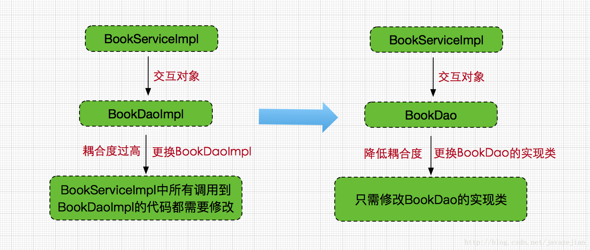
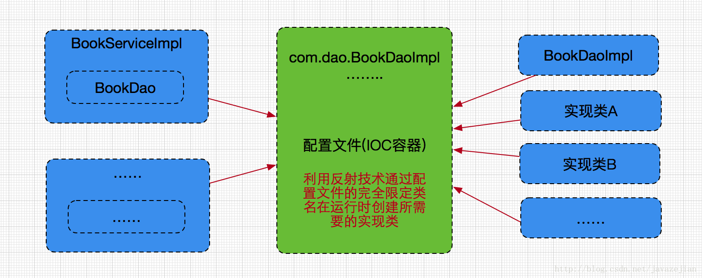
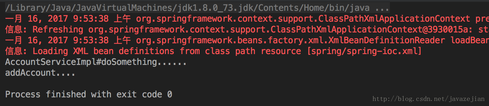

**source: [关于Spring IOC (DI-依赖注入)你需要知道的一切](http://blog.csdn.net/javazejian/article/details/54561302)**

《spring入门经典》这本书无论对于初学者或者有经验的工程师还是很值一看的，最近花了点时间回顾了Spring的内容，在此顺带记录一下，本篇主要与spring IOC相关 ，这篇博文适合初学者也适合spring有过开发经验的工程师，前者可用于全面了解Spring IOC的知识点，后者且过目进而查漏补缺，ok~，以下是主要内容：

* Spring IOC 的原理概述
* 快速入门案例
* Spring 容器装配BeanXML配置方式和注解配置方式
* Spring 依赖注入
    * Setter注入
    * 构造函数注入
    * 循环依赖
    * 自动装配与注解注入
        * 基于xml的自动装配
        * 基于注解的自动装配AutowiredResourceValue
            * 基于Autowired注解的自动装配
            * 基于Resource注解的自动装配
            * 基于Value注解的自动装配以及properties文件读取
* IOC容器管理 bean
    * Bean的命名以及实例化方法
        * Bean的命名
        * Bean实例化方法
    * Bean的重写机制
    * Bean的作用域
        * Singleton作用域
        * prototype作用域
        * request与session作用域
        * globalSession作用域
    * Bean的延长加载
* contextcomponent-scan与contextannotation-config
* IOC 与依赖注入的区别

#Spring IOC 的原理概述

在我们的日常开发中，创建对象的操作随处可见以至于对其十分熟悉的同时又感觉十分繁琐，每次需要对象都需要亲手将其new出来，甚至某些情况下由于坏编程习惯还会造成对象无法被回收，这是相当糟糕。但更为严重的是，我们一直倡导的是松耦合，少入侵原则，这种情况下变得一无是处。于是前辈们开始谋求改变这种编程陋习，考虑如何使用编码更加耦合，由此而来的解决方案是面向接口的编程，于是便有了如下写法：

    /**
     * Created by zejian on 2017/1/15.
     * Blog: http://blog.csdn.net/javazejian [原文地址，请尊重原创]
     */
    public class BookServiceImpl {
        //class
        private BookDaoImpl bookDaoImpl;
        public void oldCode()｛
            //原来的做法
            bookDaoImpl = new BookDaoImpl();
            bookDaoImpl.getAllCategories();
        }
    }
    //==============new===============
    public class BookServiceImpl {
        //interface
        private BookDao bookDao;
        public void newCode() {
            //变为面向接口编程
            bookDao = new BookDaoImpl();
            bookDao.getAllCategories();
        }
    }

BookServiceImpl类中由原来直接与BookDaoImpl打交道变换为与BookDao打交道，即使BookDao最终实现依然是BookDaoImpl，这样做的好处是显而易见的，所有调用都通过接口BookDao来完成，而接口的真正的实现者和最终的执行都是BookDaoImpl，当修改BookDaoImpl时，触及的代码就非常少了，即使替换BookDaoImpl类，也只需要修改BookDao指向新的实现类。

虽然上述的代码在很大程度上降低了代码的耦合度，但是代码依旧存在入侵性和一定程度的耦合性，比如在修改BookDao的实现类时，仍然需要修改BookServiceImpl的内部代码，当依赖的类多起来时，查找和修改的过程会显得相当糟糕，因此我们仍需要寻找一种方式，它可以令开发者无需触及BookServiceImpl内部代码的情况下实现修改BookDao的实现类，以便达到最低耦合度和最少入侵的目的。实际上存在一种称为反射的编程技术可以协助解决上述问题，反射是一种根据给出的完整类名（字符串方式）来动态地生成对象的技术，这种编程方式这种编程方式可以对象在生成时才决定到底是哪一种对象，因此可以这样假设，在某个配置文件，该文件已写好BookDaoImpl类的完全限定名称，通过读取该文件而获取BookDao的真正实现类的完全限定名称，然后通过反射技术在运行时动态生成该类，最终赋值给BookDao接口，也就解决了刚才存在的问题，这里为简单演示，使用properties文件作为配置文件，className.properties如下：

    bookDao.name = com.zejian.spring.dao.BookDaoImpl

获取该配置文件作息动态为BookDao生成实现类：

    public class BookServiceImpl implements BookService {
        //读取配置文件的工具类
        PropertiesUtil propertiesUtil = new PropertiesUtil("conf/className.properties");
        private BookDao bookDao;
        public void DaymicObject() throws ClassNotFoundException, IllegalAccessException, InstantiationException {
            //获取完全限定名称
            String className = propertiesUtil.get("bookDao.name");
            //通过反射
            Class c = Class.forName(className);
            //动态生成实例对象
            bookDao = (BookDao) c.newInstance();
        }
    }

的确如我们所愿生成了BookDao的实例，这样做的好处是在替换BookDao的实现类的情况下只需要修改配置文件而无需触及BookServceImpl的内部代码，从而把代码修改的过程转到配置文件中，相当于BookDaoImpl及内部的BookDao通过配置文件与BookDao的实现类进行关联，BookServiceImpl与BookDao的实现类间也就实现了解耦合，当然BookServiceImpl类中存在着的BookDao对象是无法避免的，毕竟这是协同工作的基础，我们只能最大程度去解耦合。

了解了上述的问题再来理解IOC就显得简单多了。Spring IOC也是一个Java对象，在某些特定的时间被创建后，可以进行对其它对象的控制，包括初始化、创建、销毁等。简单地理解，在上述过程中，我们通过配置文件配置了BookDaoImpl实现类的完全限定名称，然后利用反射在运行时为BookDao创建实际实现类，包括BookServiceImpl的创建，Spring IOC容器都会帮我们完成，而我们唯一需要做的就是把需要创建的类和其他依赖的类以配置文件的方式告诉IOC容器需要创建哪些类和注入哪些类即可。Spring通过这种控制反转（IoC）的设计模式促进了松耦合，这种方式使一个对象依赖其它对象时会通过被动的方式传送过来（如BookServiceImpl被创建时，其依赖的BookDao的实现类也会同时被注入BookServiceImpl中），而不是通过手动创建这些类。我们可以把IoC模式看做是工厂模式的升华，可以把IoC看作是一个大工厂，只不过这个大工厂需要生成的对象都是在配置文件（XML）中给出定义的，然后利用Java的反射技术，根据XML中给出的类名生成相应的对象。从某种程度上来说，IoC相当于把在工厂方法里通过硬编码创建对象的代码，改变由XML文件来定义，也就是把工厂和对象生成这两者独立分隔开来，目的就是提高灵活性和可维护性，更是达到最低的耦合度，因此我们要明白所谓的IOC就是将对象的创建权交由Spring完成，从此解放手动创建对象的过程，同时让类与类间的关系达到最低耦合度。

#快速入门案例

理解了Spring IOC模式（容器）后，我们来看一个简单入门实例。使用Spring的IOC功能，必须先引入Spring的核心依赖包（使用Maven作为构建工具）：

    <dependency>
        <groupId>org.springframewok</groupId>
        <artifactId>spring-core</artifactId>
        <version>${spring.version}</version>
    </dependency>

    <dependency>
        <groupId>org.springframework</groupId>
        <artifactId>spring-beans</artifactId>
        <version>${spring.version}</version>
    </dependency>

    <dependency>
        <groupId>org.springframework</groupId>
        <artifactId>spring-context</artifactId>
        <version>${spring.version}</version>
    </dependency>

然后创建Dao层（AccountDao）：

    public interface AccountDao {
        void addAccount();
    }

实现类（AccountDaoImpl）：

    public class AccountDaoImpl implements AccountDao {
        @Override
        public void addAccounＴ() {
            System.out.println("addAccount...");
        }
    }

再创建Service，AccountService

    /**
     * Created by zejian 2017/1/15.
     * Blog: http://blog.csdn.net/javazejian [原文地址，请尊重原创]
     */
    public interface AccountService {
        void doSomething();
    }

实现类：

    /**
     * Created by zejian on 2017/1/15.
     * Blog: http://blog.csdn.net/javazejian [原文地址，请尊重原创]
     */
    public class AccountServiceImpl implements AccountService {
        /**
         * 需要注入的对象
         */
        private AccountDao accountDao;
        public void setAccountDao(AccountDao accountDao) {
            this.accountDao = accountDao;
        }
        @Override
        public void doSomething() {
            System.out.println("AccountServiceImpl#doSomething...");
            accountDao.addAccount();
        }
    }

上面我们创建了Dao层和Service层的接口类及其实现类，其中Service层的操作依赖于Dao层，下面通过Spring的IOC容器帮助我们创建并注入这些类。IOC使用的是XML配置文件，代码如下：

    <beans xmlns="http://www.springframework.org/schema/beans"
           xmlns:xsi="http://www.w3.org/2001/XMLSchema-instance"
           xsi:schemaLocation="http://www.springframework.org/schema/beans http://www.springframework.org/schema/beans/spring-beans.xsd">
        <!-- 声明accountDao对象，交给Spring创建 -->
        <bean name="accountDao" class="com.zejian.spring.springIoc.dao.impl.AccountDaoImpl"/>
        <!-- 声明accountService对象，交给Spring创建 -->
        <bean name="accountService" class="com.zejian.spring.springIoc.service.impl.AccountServiceImpl">
            <!-- 注入accountDao对象，需要set方法 -->
            <property name="accountDao" ref="accountDao"/>
        </bean>
    </beans>

从XML文件中，我们需要声明一个beans的顶级标签，同时需要引入核心命名空间，Spring的功能在使用时都需要声明相对应的命名空间，上述的命名空间是最基本的。然后通过bean子标签声明那些需要IOC容器帮助我们创建的类，其中name是指名IOC创建后该对象的名称（当然也可以使用id替换name，这个后面会讲到），class则是告诉IOC这个类的完全限定名称，IOC就会通过这组信息利用反射技术帮助我们创建对应的类对象，如下：

    <!-- 声明accountDao对象，交给Spring创建 -->
    <bean name="accountDao" class="com.zejian.spring.springIoc.dao.impl.AccountDaoImpl"/>

接着我们还看到如下声明，accountService声明中多出了一个property标签，这个标签指向了我们刚才创建的accountDao对象，它的作用是把accountDao对象传递给accountService实现类中的accountDao属性，该属性必须拥有set方法才能注入成功，我们把这种往accountDao对象中注入其他对象（accountDao）的操作称为依赖注入，这个后面会分析到，其中的name必须与AccountService实现类中的变量名称相同，到此我们就完成对需要创建的对象的声明。接着看看如何使用它们。

    <!-- 声明accountService对象，交给Spring创建 -->
    <bean name="accountService" class="com.zejian.spring.springIoc.service.impl.AccountSericeImpl">
        <!-- 注入accontDao对象，需要set方法 -->
        <property name="accountDao" ref="accountDao"/>
    </bean>

    public class AccountServiceImpl implements AccountService {
        /**
         * 需要注入的对象
         */
        private AccountDao accountDao;
        public void setAccountDao(AccountDao accountDao) {
            this.accountDao = accountDao;
        }
    }

使用这些需要利用Spring提供的核心类，ApplicationContext，通过该类去加载声明好的配置文件，然后便可以获取到我们需要的类了。

    @Test
    public void testByXml() throws Exception {
        //加载配置文件
        ApplicationContext applicationContext = new ClassPathXmlApplicationContext("spring/spring-ioc.xml");
        //AccountService accountService = applicationContext.getBean("accountService", AccountService.class);
        //多次获取并不会创建多个accountService对象，因为Spring默认创建是单例的作用域
        AccountService accountService = (AccountService) applicationContext.getBean("accountService");
        accountService.doSomething();
    }

能过这个简单的案例相信大家已大概理解了Spring IOC主要是干什么了，接下来就详细分析它，上述的运行结果：

#Spring容器装配Bean（XML配置方式和注解方式）

有了大概了解后，先分析一下前面案例，我们采用XML配置文件的方式对bean进行声明和管理，每一个bean标签都代表着需要被创建的对象并通过property标签可以为该类型注入其他依赖对象（关于依赖后面会分析，这里简单理解为将对象实例传入到某个bean实例即可），通过这种方式Spring容器就可以成功知道我们需要创建哪些bean实例，如下：

    <bean xmlns="http://www.springframework.org/schema/beans"
          xmlns:xsi="http://www.w3.org/2001/XMLSchema-instance"
          xsi:schemaLocation="http://www.springframework.org/schema/beans http://www.springframework.org/schema/beans/spring-beans.xsd">
        <!-- 声明accountDao对象，交给Spring创建 -->
        <bean name="accountDao" class="com.zejian.spring.springIoc.dao.impl.AccountDaoImpl"/>
        <!-- 声明accountService对象，交给Spring创建 -->
        <bean name="accountService" class="com.zejian.spring.springIoc.service.impl.AccountServiceImpl">
            <!-- 注入accountDao对象，需要set方法 -->
            <property name="accountDao" ref="accountDao"/>
        </bean>
    </beans>

然后通过ClassPathXmlApplicationContext去加载Spring配置文件，接着获取想要的实例bean并调用相应方法执行。对于ClassPathXmlApplicationContext默认加载classpath路径下的文件，只需要指明对应文件的classpath路径即可。如果存在多个配置文件，则只需分别传递即可，ClassPathXmlApplicationContext是一个可以接收可变参数的构造函数。实际上ClassPathXmlApplicationContext还有一个孪生兄弟FileSystemXmlApplicationContext，它默认为项目工作路径即项目的根目录，至于使用哪个，博言觉得没有多大的差别。

    //默认查找classpath路径下的文件
    ApplicationContext applicationContext = new ClassPathXmlApplicationContext("spring/spring-ioc.xml");
    //多文件，也可传递数组
    ApplicationContext applicationContext = new ClassPathXmlApplicationContext("spring/spring-ioc.xml", "spring/spring-ioc2.xml", ...);
    //默认为项目工作路径 即项目的根目录
    FileSystemXmlApplicationContext applicationContext = new FileSystemXmlApplicationContext("/src/main/resources/spring/spring-ioc.xml");
    //也可以读取classpath下的文件
    FileSystemApplicationContext applicationContext = new FileSystemXmlApplicationContext("classpath:spring/spring-ioc.xml");
    //使用前缀file表示的是文件的绝对路径
    ApplicationContext applicationContext = new FileSystemXmlApplicationContext("file:D:/app.spring.xml");
    //多文件与ClassPathXmlApplicationContext相同

ok~，了解完如何加载配置文件后，下面将采用注解的方式来达到上述XML的配置效果：

    package com.zejian.spring.springIoc.conf;

    import com.zejian.spring.springIoc.dao.AccountDao;
    import com.zejian.spring.springIoc.dao.impl.AccountDaoImpl;
    import com.zejian.spring.springIoc.service.AccountService;
    import com.zejian.spring.springIoc.service.impl.AccountServiceImpl;
    import org.springframework.context.annotation.Bean;
    import org.springframework.context.annotation.Configuration;

    /**
     * Created by zejian on 2017/1/15.
     * Blog: http://blog.csdn.net/javazejian [原文地址，表尊重原创]
     */
    @Configuration
    public class BeanConfiguration {
        @Bean
        public AccountDao accountDao() {
            return new AccountDaoImpl();
        }
        @Bean
        public AccountService accountService() {
            AccountServiceImpl bean = new AccountServiceImpl();
            //注入dao
            bean.setAccountDao(accountDao());
            return bean;
        }
    }

上述代码中使用了@Configuration注解标明BeanConfiguration类，使得BeanConfiguration类替代了XML文件，也就是说注解@Configuration等价于<beans>标签。在该类中，每个使用注解@Bean的公共方法对应着一个<bean>标签的定义，即@Bean等价于<bean>标签。这种基于Java的注解配置方式是在Spring3.0中引入的，此时使用到注解，因此必须确保spring-context包已引入。

    <dependency>
        <groupId>org.springframework</groupId>
        <artifactId>spring-context</artifactId>
        <version>${spring.version}</version>
    </dependency>

那怎么使用呢？事实上跟XML很相似，不过这是使用到AnnotationConfigApplicationContext来加载Java的配置文件，运行结果跟XML一样。

    @Test
    public void testByConfigurationAnnotation() throws Exception {
        AnnotationConfigApplicationContext config = new AnnotationConfigApplicationContext(BeanConfiguration.class);
        //名称必须和BeanConfiguration中方法名称一致
        AccountService accountService = (AccountService) config.getBean("accountService");
        accountService.doSomething();
    }

这里我们需要明白的是，在大部分情况下更倾向于使用XML来配置Bean的相关信息，这样会更加方便我们对代码进行管理，因此后面的分析都会基于XML的配置，除了前面通过在XML中使用<bean>标签为每个类声明实例外，Spring容器还为我们提供了基于注解的声明方式，这点放在后面分析，接下来看一下Spring提供的依赖注入功能。

#Spring依赖注入

所谓的依赖注入，其实是当一个bean实例引用到了另外一个bean实例时Spring容器帮助我们创建依赖的bean实例并注入（传递）到另一个bean中